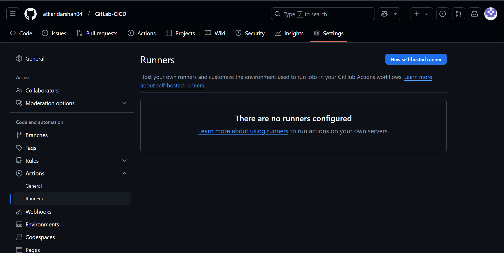
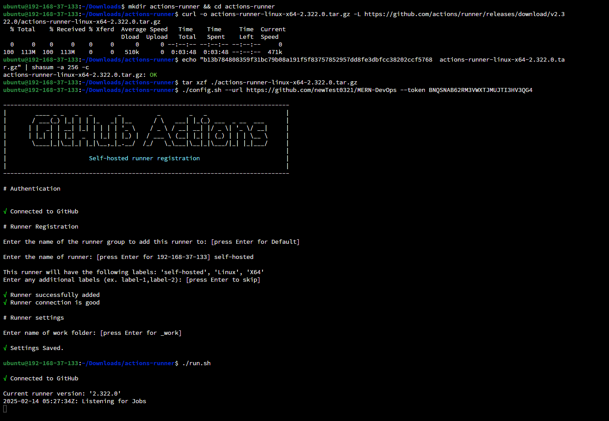
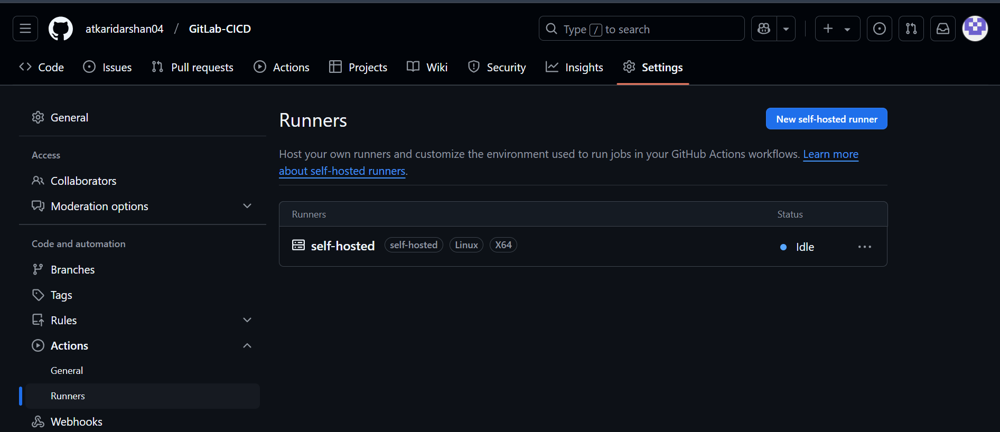
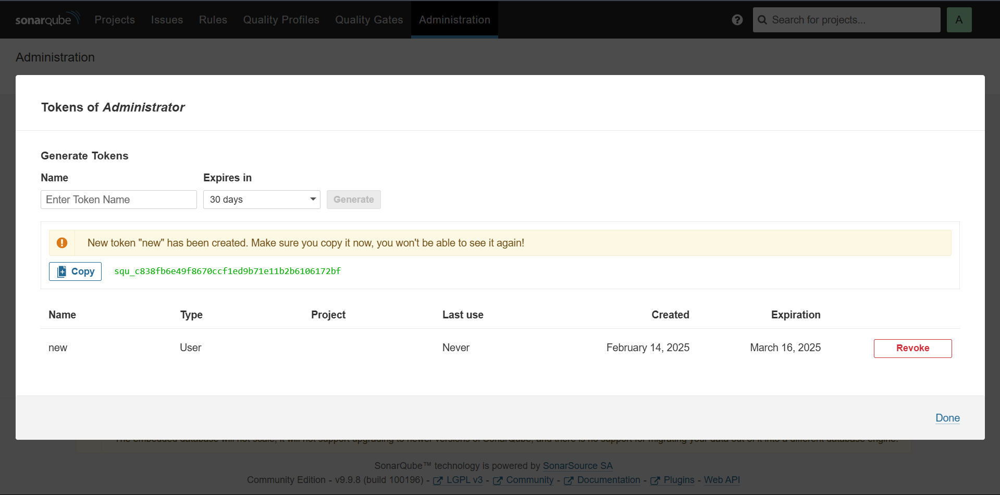
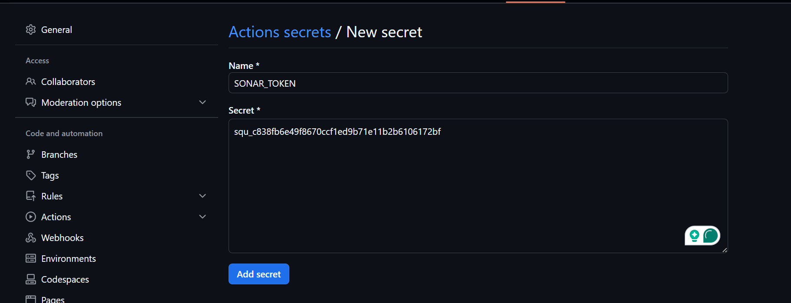
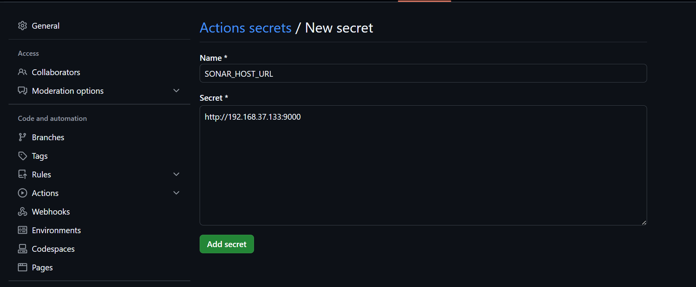
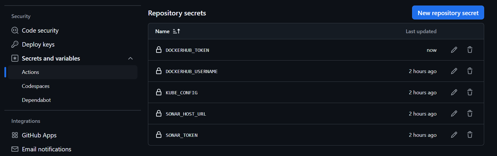
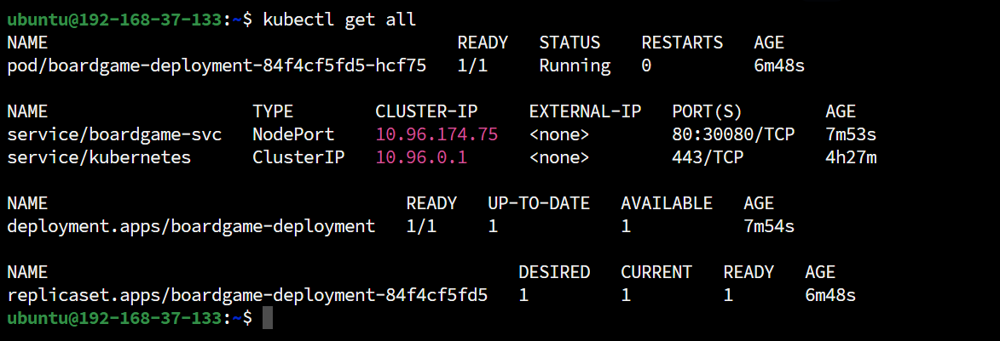
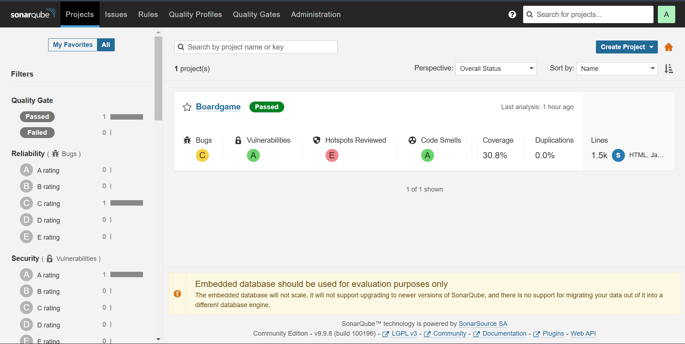
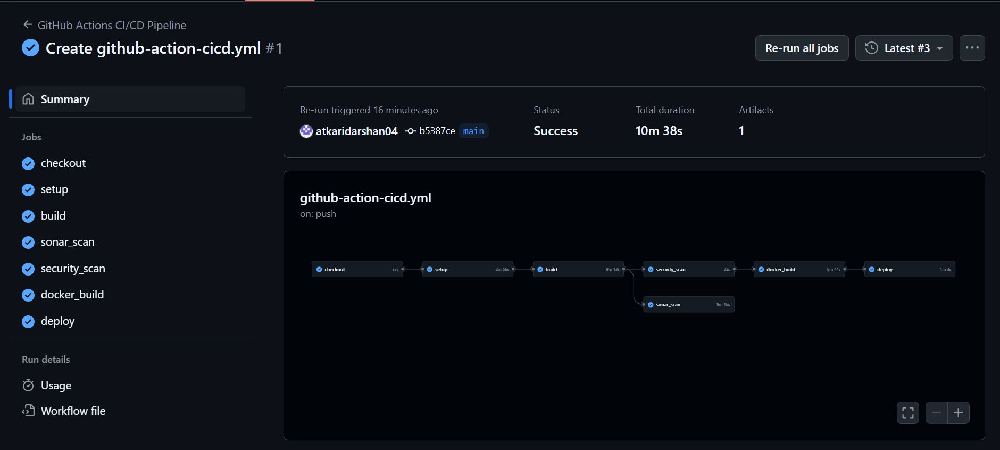

# ⚡ GitHub Actions CI/CD Pipeline Implementation

> Complete guide for implementing a DevSecOps CI/CD pipeline using GitHub Actions with Maven, Trivy, SonarQube, Docker, and Kubernetes deployment.

## 📋 Prerequisites

- GitHub repository
- Linux environment for self-hosted runner
- Docker installed
- kubectl and kind installed
- SonarQube instance
- DockerHub account


## 🔧 Implementation Steps

### 1️⃣ Self-Hosted Runner Configuration

#### 🏃‍♂️ Set Up GitHub Runner

1. Navigate to **GitHub** → **Settings** → **Actions** → **Runners**
   
   

2. Select **Linux** as your runner platform
   
   

3. Follow the installation instructions provided by GitHub
   
   

4. Verify the runner is active and idle
   
   

---

### 2️⃣ SonarQube Setup & Integration

#### 🐳 Deploy SonarQube

Deploy SonarQube using Docker:

```bash
docker run -d -p 9000:9000 sonarqube:lts-community
```

Access SonarQube at: `http://<your-ip>:9000`

> 🔐 **Default Credentials:** Username: `admin` | Password: `admin`

#### 🔑 Generate SonarQube Token

1. Navigate to **SonarQube** → **Administration** → **Security**
   
   

2. Generate a new token for GitHub integration
   
   

---

### 3️⃣ GitHub Secrets Configuration

#### 🔒 Add Required Secrets

Navigate to **GitHub** → **Settings** → **Secrets and Variables** → **Actions**

1. **Add SonarQube Token:**
   
   

2. **Add SonarQube Host URL:**
   
   

---

### 4️⃣ Kubernetes Cluster Setup

#### 🎯 Create KIND Cluster

```bash
kind create cluster --config kind-config.yml
```

**kind-config.yml:**
```yaml
kind: Cluster
apiVersion: kind.x-k8s.io/v1alpha4
nodes:
  - role: control-plane
    extraPortMappings:
      - containerPort: 30080
        hostPort: 30080
        protocol: TCP
```

#### 🔧 Configure Kubernetes Access

1. **Encode kubeconfig for GitHub Secrets:**
   ```bash
   base64 ~/.kube/config
   ```

2. **Add encoded config to GitHub Secrets:**
   
   

---

### 5️⃣ DockerHub Integration

#### 🐳 Add DockerHub Credentials

Add your DockerHub username and password to GitHub Secrets for container registry access.

**Verify all secrets are configured:**



---

### 6️⃣ GitHub Actions Workflow Setup

#### 📝 Configure Workflow

1. Navigate to **GitHub** → **Actions** → **Workflows**
2. Select **Java with Maven** workflow template
3. Replace the content with your CI/CD pipeline configuration from:
   
   📄 [.github/workflows/github-action-cicd.yml](.github/workflows/github-action-cicd.yml)

4. Commit and save the workflow file


## 🎯 Pipeline Verification

### ✅ Deployment Verification

**1. Kubernetes Deployment Status:**



**2. SonarQube Analysis Results:**



**3. Complete Pipeline Status:**




## 🚀 Pipeline Stages Overview

The GitHub Actions CI/CD pipeline includes:

- **🔨 Build & Test** - Maven compilation and unit testing
- **🛡️ Security Scanning** - Trivy vulnerability assessment
- **📊 Code Quality** - SonarQube static analysis
- **🐳 Container Build** - Docker image creation and push
- **🚀 Deployment** - Kubernetes cluster deployment
- **✅ Verification** - Post-deployment health checks
